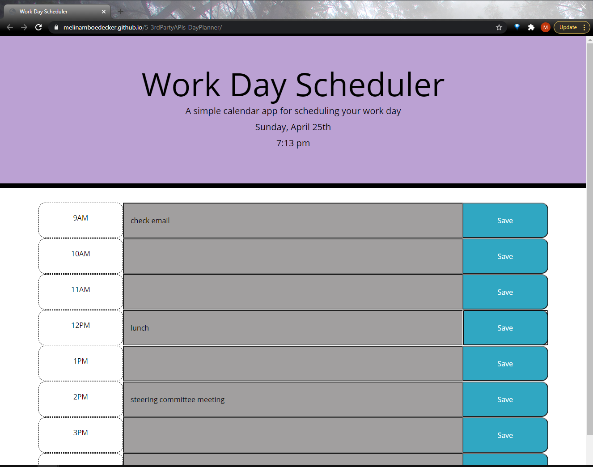

# 5-3rdPartyAPIs-DayPlanner
Simple Calendar App

## Description:
This is a calendar application that allows a user to plan out thier workday. Users can save text for each hour represented in the table. Each hour time block will change colors based on the current time with the current hour being red, past hours being gray and future hours being green.  The current date and time is displayed at the top of the screen.

This App was created with dynamically updated HTML and CSS powered by jQuery.  User entered data is stored in local Storage. Current date and time features utilize Moment.js. 

## Technologies:
HTML, CSS, and Javascript
openweathermap API

## Screenshot

## Link
https://melinamboedecker.github.io/5-3rdPartyAPIs-DayPlanner/

## License
Copyright (c) 2021 Melina Boedecker
Licensed under the MIT license.